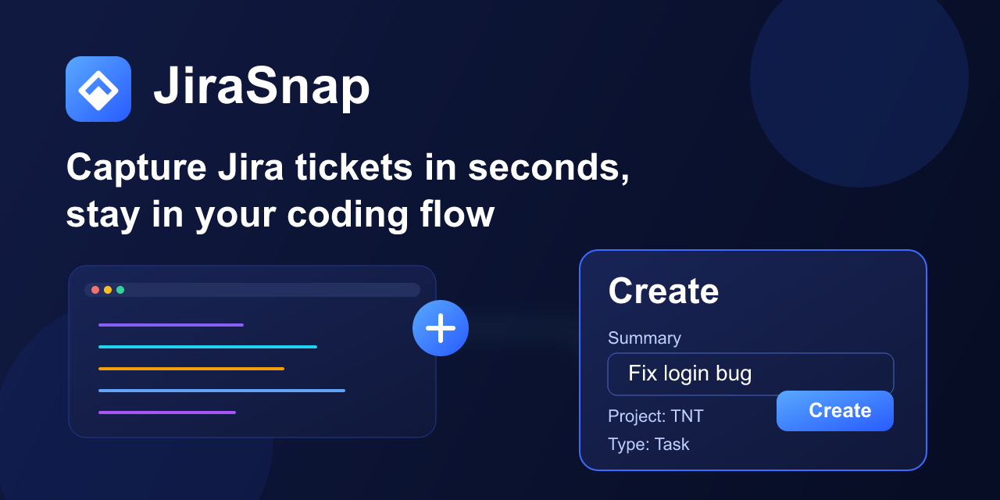

# JiraSnap

Create Jira tasks from VS Code in seconds.

[](https://marketplace.visualstudio.com/items?itemName=troyjohnson-devtools.jirasnap)



JiraSnap is a focused capture extension: minimal prompts, automatic context, and reliable issue creation even when parent assignment fails.

## Quick Start (Fast Path)

1. Complete required setup settings (`jirasnap.baseUrl`, `jirasnap.email`, `jirasnap.apiToken`, `jirasnap.projectKey`).
2. In any editor tab, press `cmd+shift+j`.
3. Enter title and optional note.

This shortcut is the primary workflow for JiraSnap and the fastest way to capture work without leaving your coding flow.

If `cmd+shift+j` triggers the wrong command (for example `Invalid JSON, please check manually`), open Keyboard Shortcuts, search `cmd+shift+j`, and keep only `JiraSnap: Capture Task`.

## Before First Use (Required Setup)

JiraSnap will not create issues until your Jira account and project settings are configured.

1. Set required connection settings:

- `jirasnap.baseUrl`
- `jirasnap.email`
- `jirasnap.apiToken`
- `jirasnap.projectKey`

2. Confirm your Jira user can create issues in that project.
3. If your company enforces additional required Jira fields, map them in `jirasnap.customFieldsJson` (see section below).

If required settings are missing, JiraSnap shows an error and offers to open settings.

## Features

- Fast command-driven capture from inside the editor
- Optional parent epic assignment
- Automatic fallback to unparented task if parent is invalid
- Automatic label (`jirasnap`)
- Optional quick note + captured context
  - repo
  - branch
  - file path
  - selected line range
  - timestamp
- Open captures view using configurable JQL
- Status bar shortcut for quick access

## Commands

- `JiraSnap: Capture Task`
- `JiraSnap: Open Captures`

Default keybinding (primary workflow):

- macOS: `cmd+shift+j`

## Requirements

- Jira Cloud base URL
- Jira account email
- Jira API token
- Jira project key

Create an Atlassian API token at:

- https://id.atlassian.com/manage-profile/security/api-tokens

## Extension Settings

Required settings:

- `jirasnap.baseUrl`
- `jirasnap.email`
- `jirasnap.apiToken`
- `jirasnap.projectKey`

Optional settings:

- `jirasnap.defaultEpicKey`
  - accepts issue key (example: `TNT-1900`) or full browse URL
- `jirasnap.capturesJql`
  - default: `labels = jirasnap ORDER BY created DESC`
- `jirasnap.showStatusBarOpenCaptures`
  - default: `true`
- `jirasnap.customFieldsJson`
  - default: `{}`
  - JSON object merged into Jira issue fields for company-specific required fields
  - example: `{"customfield_11302":{"value":"Yes"},"customfield_12345":"ABC"}`
- `jirasnap.capitalizableFieldId`
  - default: empty
  - legacy optional single-field shortcut; use `jirasnap.customFieldsJson` for multiple fields
- `jirasnap.capitalizableValue`
  - default: `Yes`

## Company-Specific Required Fields (Important)

Many Jira instances require custom fields beyond summary/project/type. These are different for every company (and sometimes per project/issue type).

Use `jirasnap.customFieldsJson` to map those fields for your account.

Example:

```json
{
  "customfield_11302": { "value": "Yes" },
  "customfield_12345": "ABC"
}
```

How to find your required fields:

1. In Jira web, open the project and choose **Create issue** (same project and issue type you use in JiraSnap, usually `Task`).
2. Note every field marked with a red asterisk (`*`) — those are required.
3. Open browser DevTools (`F12` or `Cmd+Option+I`), go to the **Network** tab, and filter by `XHR` or search for `issue`.
4. Submit the create form. A request to `/rest/api/2/issue` or `/rest/api/3/issue` will appear.
5. Click that request, open the **Payload** (or **Request Body**) tab, and copy the JSON. The keys that look like `customfield_12345` with their values are exactly what you need.
6. Paste those key/value pairs into `jirasnap.customFieldsJson` in VS Code settings.

Common value shapes:

- Text field: `"customfield_12345": "Some text"`
- Single select: `"customfield_12345": { "value": "Yes" }`
- Multi select: `"customfield_12345": [{ "value": "Option A" }, { "value": "Option B" }]`
- User picker: `"customfield_12345": { "accountId": "<jira-account-id>" }`
- Number: `"customfield_12345": 5`

Legacy note:

- `jirasnap.capitalizableFieldId` and `jirasnap.capitalizableValue` are kept for backward compatibility, but `jirasnap.customFieldsJson` is the recommended approach.

## How It Works

1. Run `JiraSnap: Capture Task`.
2. Enter title and optional quick note.
3. JiraSnap builds Jira ADF description with captured context.
4. JiraSnap attempts to create task with parent if configured.
5. If parent is rejected, JiraSnap retries without parent.
6. JiraSnap returns a clickable issue link.

## Installation

### Install from Marketplace

- https://marketplace.visualstudio.com/items?itemName=troyjohnson-devtools.jirasnap

### Install from VSIX (local)

1. In VS Code Extensions view, open `...` menu.
2. Select `Install from VSIX...`.
3. Choose `jirasnap-<version>.vsix` (for example `jirasnap-0.0.4.vsix`).

### Development install

1. Clone repository.
2. Run `npm install`.
3. Press `F5` to launch Extension Development Host.

## Usage Example

1. Set required settings.
2. Run `JiraSnap: Capture Task`.
3. Enter:
   - Title: `Fix missing cache invalidation on product update`
   - Quick note: `Observed while testing update endpoint`
4. JiraSnap creates the task and offers `Open Issue`.

## Troubleshooting

- `Authentication failed`
  - verify `jirasnap.email` and `jirasnap.apiToken`
- `Permission denied`
  - your Jira account cannot create issues in that project
- `Project key not found` or project create failure
  - verify `jirasnap.projectKey`
- Parent/epic errors
  - clear or correct `jirasnap.defaultEpicKey`; JiraSnap can create without parent
- Jira custom field errors
  - confirm `jirasnap.capitalizableFieldId` and option value for your Jira instance
- `jirasnap.customFieldsJson is invalid JSON`
  - set `jirasnap.customFieldsJson` to a valid JSON object string
  - example: `{"customfield_11302":{"value":"Yes"}}`
- Description format errors
  - JiraSnap sends ADF automatically; if this appears again, validate against the latest packaged version
- `Invalid JSON, please check manually` appears when pressing `cmd+shift+j`
  - this is usually a keybinding conflict with another command
  - confirm JiraSnap works from Command Palette: `JiraSnap: Capture Task`
  - open Keyboard Shortcuts, search `cmd+shift+j`, keep only `JiraSnap: Capture Task`
  - remove conflicting bindings such as `json.shortcut` and `workbench.action.search.toggleQueryDetails`

## Validation

- `npm run lint`
- `npm run build`
- `npm test`
- `npm run smoke` (live Jira call, requires credentials in env)

Smoke environment variables:

- `JIRASNAP_BASE_URL`
- `JIRASNAP_PROJECT_KEY`
- `JIRASNAP_PARENT_KEY`
- `JIRASNAP_SKIP_PARENT=1`
- `JIRASNAP_EMAIL` / `JIRASNAP_API_TOKEN` (or `JIRA_EMAIL` / `JIRA_API_TOKEN`)

## Real Jira Validation Checklist

Use this before publishing or after major changes:

1. Create a task with a valid parent epic.
2. Create a task with no parent configured.
3. Create a task with an invalid parent and confirm fallback succeeds.
4. Open captures from the status bar or `JiraSnap: Open Captures`.
5. Verify created issue includes:

- label `jirasnap`
- capitalizable field set to `Yes`
- captured description context

## Project Docs

- Working task list: [docs/todo.md](docs/todo.md)
- Troubleshooting notes and publish gotchas: [docs/troubleshooting.md](docs/troubleshooting.md)
- Release notes: [CHANGELOG.md](CHANGELOG.md)
- Publishing steps: [docs/PUBLISHING.md](docs/PUBLISHING.md)

## License

MIT. See [LICENSE](LICENSE).
