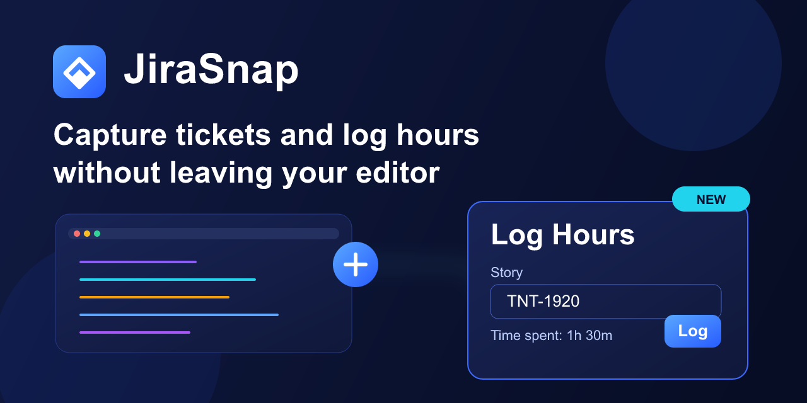

# JiraSnap

Create Jira tickets and log work hours from VS Code — without breaking your flow.

[](https://marketplace.visualstudio.com/items?itemName=troyjohnson-devtools.jirasnap)



JiraSnap gives you three things:

1. **Capture a Jira ticket in seconds** with `Cmd+Shift+J`. Title + optional note, and JiraSnap auto-fills the description with your repo, branch, file path, and selected lines.
2. **Log work hours against any of your stories** from the Command Palette. Pick a story from a filterable dropdown, type the time spent, done.
3. **Reopen your recent captures** with one click from the status bar.

---

## Install

### From the Marketplace (recommended)

Open VS Code's Extensions sidebar, search **JiraSnap**, click **Install**.

Or browse the listing here: [marketplace.visualstudio.com/items?itemName=troyjohnson-devtools.jirasnap](https://marketplace.visualstudio.com/items?itemName=troyjohnson-devtools.jirasnap).

### From a local .vsix file

1. In VS Code, open the **Extensions** sidebar.
2. Click the `...` menu in the top right of that sidebar.
3. Choose **Install from VSIX...** and pick `jirasnap-<version>.vsix` (e.g. `jirasnap-0.1.0.vsix`).

---

## 5-Minute Setup

You need to do this once. Until you do, JiraSnap will refuse to create issues and tell you what's missing.

### Step 1 — Get a Jira API token

1. Go to [id.atlassian.com/manage-profile/security/api-tokens](https://id.atlassian.com/manage-profile/security/api-tokens).
2. Click **Create API token**, give it a label like "JiraSnap", click **Create**.
3. **Copy the token immediately** — Atlassian will not show it again. Paste it somewhere safe for the next step.

### Step 2 — Fill in four VS Code settings

1. Open VS Code Settings: `Cmd + ,` (Mac) or `Ctrl + ,` (Windows/Linux).
2. In the search bar at the top, type `jirasnap`.
3. Fill in these four required fields:

   | Setting | What to put in it | Example |
   |---|---|---|
   | `jirasnap.baseUrl` | Your Jira Cloud URL | `https://your-org.atlassian.net` |
   | `jirasnap.email` | The email tied to your Atlassian account | `you@your-org.com` |
   | `jirasnap.apiToken` | The API token you copied in Step 1 | `ATATT3xFf...` |
   | `jirasnap.projectKey` | The project key new tickets should land in | `TNT` |

> Not sure of your project key? Open any existing ticket in Jira — the key is the prefix of the issue ID (e.g. `TNT-1920` → project key is `TNT`).

### Step 3 — Try it

1. Open any file in VS Code.
2. Press `Cmd + Shift + J` (Mac) or `Ctrl + Shift + J` (Windows/Linux).
3. Type a title like `JiraSnap test`, hit Enter, skip the optional note.
4. JiraSnap shows a confirmation toast with an **Open Issue** button. Click it. The ticket should open in Jira.

If you got a ticket, you're done. Skip to **Daily Use** below.

If you got an error, jump to **Troubleshooting** at the bottom.

> **Company requires extra fields on new tickets?** (For example, "Capitalizable" must be set to "Yes" on every Chewy ticket.) See [Map your company's required custom fields](#map-your-companys-required-custom-fields) below — Step 3 will fail until those are configured.

---

## Daily Use

JiraSnap exposes three commands. All three are in the Command Palette (`Cmd+Shift+P`):

- `JiraSnap: Capture Task` — create a Jira ticket
- `JiraSnap: Hours` — log work hours against a story
- `JiraSnap: Open Captures` — open a Jira search of your recent captures

### Capture a ticket from your editor

The fastest way is the keyboard shortcut.

1. Optionally select a few lines of code that are relevant to the ticket.
2. Press `Cmd + Shift + J` (Mac) or `Ctrl + Shift + J` (Windows/Linux).
3. Enter a title and hit Enter.
4. Optionally enter a quick note. (Hit Enter to skip.)
5. JiraSnap creates the ticket and shows an **Open Issue** button.

The ticket description is auto-filled with:

- repo name
- current git branch
- file path
- selected line range (if anything was selected)
- timestamp
- your quick note (if you entered one)

The ticket also gets a `jirasnap` label so you can find it later via **Open Captures**.

If you set `jirasnap.defaultEpicKey`, JiraSnap will attach the ticket to that epic. If the parent assignment fails (wrong issue type hierarchy, etc.), JiraSnap will retry without the parent rather than fail outright.

### Log hours against a story

1. Open the Command Palette: `Cmd + Shift + P` (Mac) or `Ctrl + Shift + P` (Windows/Linux).
2. Type `JiraSnap: Hours` and hit Enter.
3. Pick a story from the dropdown.
4. Type the time spent and hit Enter:

   | You type | Means |
   |---|---|
   | `30m` | 30 minutes |
   | `2h` | 2 hours |
   | `1h 15m` | 1 hour 15 minutes |
   | `2w 4d 6h 45m` | weeks, days, hours, minutes |

5. Done. The worklog appears on the issue in Jira immediately, the same as if you'd logged it in the Jira UI.

> The dropdown defaults to **every unresolved issue assigned to you**, which is usually too many. To filter it, see [Filter the Hours dropdown with JQL](#filter-the-hours-dropdown-with-jql).

### Open your recent captures

Either:

- Click the **JiraSnap** button in the VS Code status bar (bottom edge), or
- Run `JiraSnap: Open Captures` from the Command Palette.

This opens a Jira search for `labels = jirasnap ORDER BY created DESC` (configurable via `jirasnap.capturesJql`).

---

## Configuration Reference

Open VS Code Settings (`Cmd + ,`) and search for `jirasnap` to see all of these.

### Required

| Setting | Purpose |
|---|---|
| `jirasnap.baseUrl` | Your Jira Cloud URL, e.g. `https://your-org.atlassian.net` |
| `jirasnap.email` | The email tied to your Atlassian account |
| `jirasnap.apiToken` | API token from [id.atlassian.com/manage-profile/security/api-tokens](https://id.atlassian.com/manage-profile/security/api-tokens) |
| `jirasnap.projectKey` | Project key for new tickets, e.g. `TNT` |

### Optional

| Setting | Purpose | Default |
|---|---|---|
| `jirasnap.defaultEpicKey` | Attach new tickets to this epic. Accepts an issue key (`TNT-1900`) or a full Jira browse URL. JiraSnap falls back to creating without a parent if assignment fails. | empty |
| `jirasnap.capturesJql` | JQL used by **Open Captures** | `labels = jirasnap ORDER BY created DESC` |
| `jirasnap.showStatusBarOpenCaptures` | Show the status-bar button | `true` |
| `jirasnap.customFieldsJson` | JSON object merged into every new ticket. Use this for company-required custom fields. See [Map your company's required custom fields](#map-your-companys-required-custom-fields). | `{}` |
| `jirasnap.hoursJql` | JQL filter for the **Hours** dropdown. See [Filter the Hours dropdown with JQL](#filter-the-hours-dropdown-with-jql). | `assignee = currentUser() AND resolution = Unresolved ORDER BY updated DESC` |

---

## Advanced

### Map your company's required custom fields

A lot of Jira instances require custom fields on every new ticket — e.g. Chewy requires "Capitalizable" to be either "Yes" or "No". JiraSnap can fill these in automatically via the `jirasnap.customFieldsJson` setting.

#### Quick example: Chewy's "Capitalizable" field

1. Open VS Code Settings (`Cmd + ,`), search for `jirasnap`.
2. Find **JiraSnap: Custom Fields Json** and click **Edit in settings.json**.
3. Add this entry to the JSON object:

   ```json
   "jirasnap.customFieldsJson": "{\"customfield_11302\":{\"value\":\"Yes\"}}"
   ```

   (Or use the UI input box and paste just the inner JSON: `{"customfield_11302":{"value":"Yes"}}`.)

4. Save. New tickets will now include Capitalizable=Yes automatically.

#### How to find your company's required field IDs

1. In Jira web, open the project and click **Create issue** for the same issue type JiraSnap uses (typically `Task`).
2. Note every field marked with a red asterisk — those are required.
3. Open browser DevTools (`F12` or `Cmd+Option+I`), go to the **Network** tab, filter by `XHR`.
4. Submit the create form. Look for a `POST` to `/rest/api/2/issue` or `/rest/api/3/issue`.
5. Click that request → **Payload** (or **Request Body**) tab → copy the JSON. Keys that start with `customfield_` are the IDs you need.
6. Paste those key/value pairs into `jirasnap.customFieldsJson`.

#### Common value shapes

The shape of the value depends on the field type. The most common:

| Field type | Shape |
|---|---|
| Plain text | `"customfield_12345": "Some text"` |
| Single-select dropdown | `"customfield_12345": { "value": "Yes" }` |
| Multi-select dropdown | `"customfield_12345": [{ "value": "Option A" }, { "value": "Option B" }]` |
| User picker | `"customfield_12345": { "accountId": "<jira-account-id>" }` |
| Number | `"customfield_12345": 5` |

### Filter the Hours dropdown with JQL

By default, `JiraSnap: Hours` shows every unresolved issue assigned to you, which is usually way too many. Set `jirasnap.hoursJql` to any valid JQL string and the dropdown will only show matching issues.

#### How to set it

1. Open VS Code Settings (`Cmd + ,`), search for `jirasnap.hoursJql`.
2. Paste your JQL into the box. No outer quotes, no escaping — just the raw JQL.
3. Reload the window (`Cmd+Shift+P` → `Developer: Reload Window`).

#### Example: a real-world filter

Show only Capitalizable TNT stories assigned to me that are currently In Progress or Blocked:

```
"Capitalizable" = "Yes" AND assignee = currentUser() AND project = TNT AND status in ("In Progress", "Blocked") ORDER BY updated DESC
```

#### JQL syntax gotchas

- **Custom fields:** reference them by **display name in quotes** (`"Capitalizable"`) or **`cf[id]` form** (`cf[11302]`). The REST API name `customfield_11302` is **not** valid in JQL.
- **String values:** quote anything with spaces or that could be mistaken for a reserved word — `"In Progress"`, `"Yes"`, `"Blocked"`.
- **`currentUser()`:** resolves to the account behind your `jirasnap.apiToken`. No need to hardcode your email.

#### Don't write JQL by hand — let Rovo do it

Atlassian's built-in AI assistant **Rovo** (in the Jira web UI) will generate JQL for you. Open any Jira project, click the Rovo icon (sparkles, usually top-right), and ask in plain English:

> Give me the JQL to show stories where Capitalizable is Yes, assigned to me, in project TNT, with status In Progress or Blocked.

Rovo returns a JQL string you can paste straight into `jirasnap.hoursJql`.

#### Validate a JQL string before saving it

POST it to the JQL parser endpoint. It returns the parsed structure on success or a precise error on failure:

```bash
curl -s -u "<your-email>:<your-api-token>" \
  -H "Content-Type: application/json" \
  -X POST "https://<your-org>.atlassian.net/rest/api/3/jql/parse?validation=strict" \
  -d '{"queries":["YOUR JQL HERE"]}'
```

---

## Troubleshooting

### "JiraSnap is missing required settings: ..."

You skipped Step 2 of setup. Click **Open Settings** in the error toast, fill in the listed setting(s), and try again.

### "Authentication failed" / 401

Either `jirasnap.email` or `jirasnap.apiToken` is wrong. Generate a fresh API token from [id.atlassian.com/manage-profile/security/api-tokens](https://id.atlassian.com/manage-profile/security/api-tokens), paste it into `jirasnap.apiToken`, and try again.

### "Permission denied" / 403

Your Jira account doesn't have permission to create issues in the project you set in `jirasnap.projectKey`. Either pick a different project or ask your Jira admin for permission.

### Capture works but the ticket is missing a required field

Your Jira project requires a custom field that JiraSnap isn't supplying. Set `jirasnap.customFieldsJson` — see [Map your company's required custom fields](#map-your-companys-required-custom-fields).

### "jirasnap.customFieldsJson is invalid JSON"

The setting must be a valid JSON object string. Example: `{"customfield_11302":{"value":"Yes"}}`. Common mistake: leaving a trailing comma.

### `JiraSnap: Hours` dropdown is empty or shows the wrong stories

Your `jirasnap.hoursJql` resolves to no issues, or returns too many. Validate the JQL with the curl command in [Validate a JQL string before saving it](#validate-a-jql-string-before-saving-it).

### `Cmd+Shift+J` triggers the wrong command

Another extension or VS Code feature is bound to the same shortcut.

1. `Cmd+Shift+P` → `Preferences: Open Keyboard Shortcuts`.
2. Search `cmd+shift+j`.
3. Keep only `JiraSnap: Capture Task`. Remove conflicts like `json.shortcut` or `workbench.action.search.toggleQueryDetails`.

### Parent / epic errors when capturing

Either clear `jirasnap.defaultEpicKey` or set it to a valid issue key. JiraSnap retries without the parent automatically if the parent assignment fails, so capture will still succeed — you just won't get the epic link.

---

## For Developers

### Build and run from source

```bash
git clone https://github.com/buildermindset/jirasnap
cd jirasnap
npm install
```

Press `F5` in VS Code to launch an Extension Development Host with JiraSnap loaded.

### Validation

```bash
npm run lint
npm run build
npm test
npm run smoke   # live Jira call, requires creds in env
```

Smoke environment variables:

- `JIRASNAP_BASE_URL`
- `JIRASNAP_PROJECT_KEY`
- `JIRASNAP_PARENT_KEY`
- `JIRASNAP_SKIP_PARENT=1`
- `JIRASNAP_EMAIL` / `JIRASNAP_API_TOKEN` (or `JIRA_EMAIL` / `JIRA_API_TOKEN`)

### Project docs

- Open work: [docs/todo.md](docs/todo.md)
- Publishing notes: [docs/PUBLISHING.md](docs/PUBLISHING.md)
- Long-form troubleshooting: [docs/troubleshooting.md](docs/troubleshooting.md)
- Release notes: [CHANGELOG.md](CHANGELOG.md)

---

## License

MIT. See [LICENSE](LICENSE).
